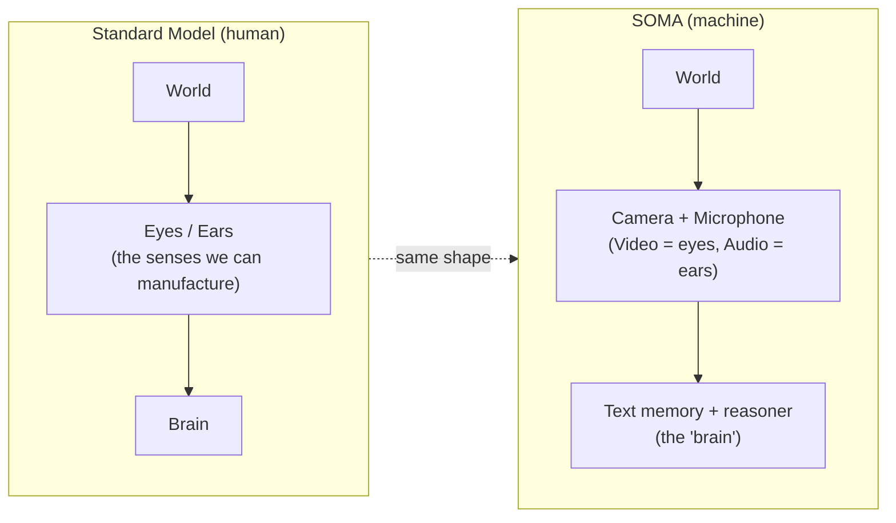
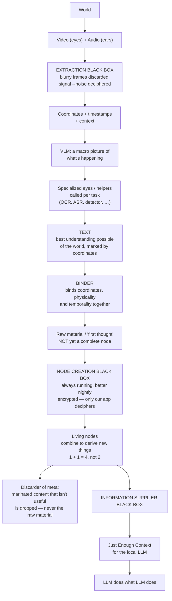
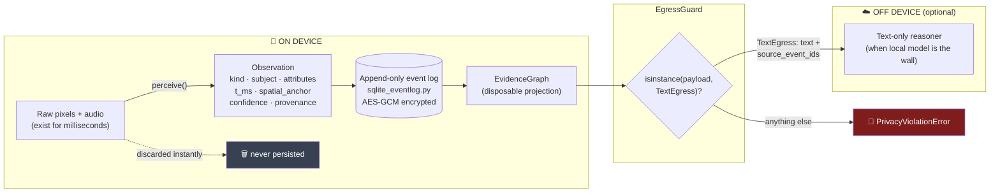
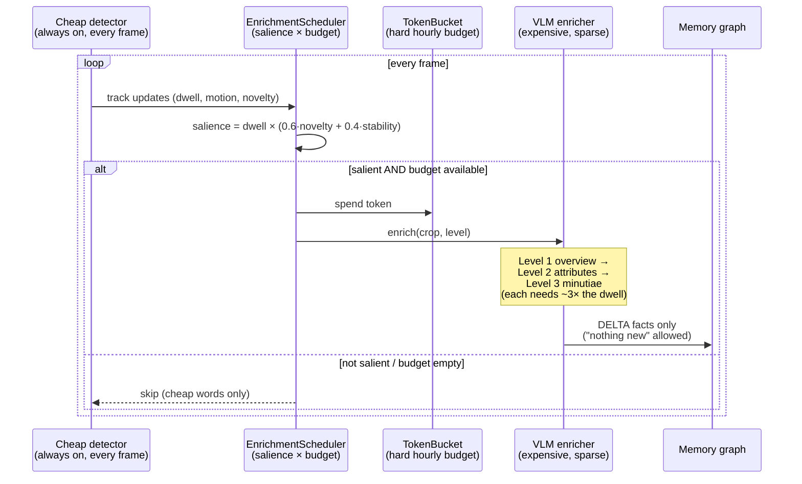
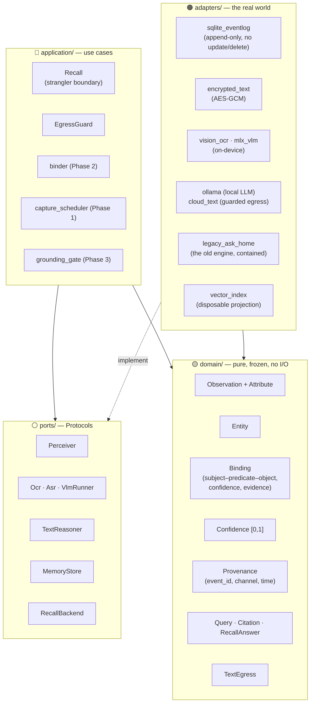
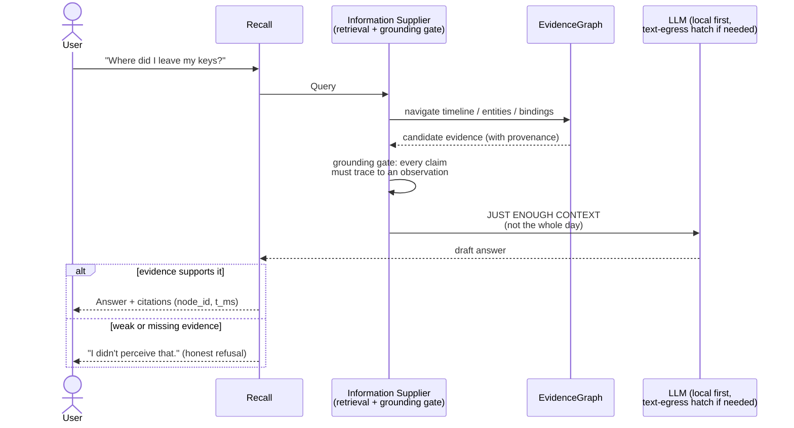
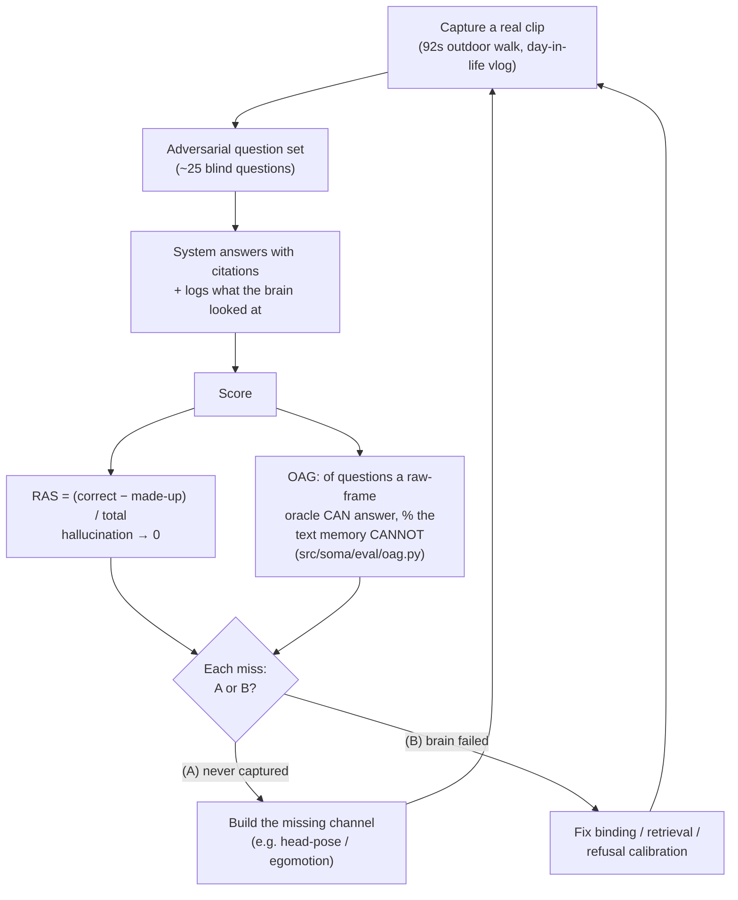
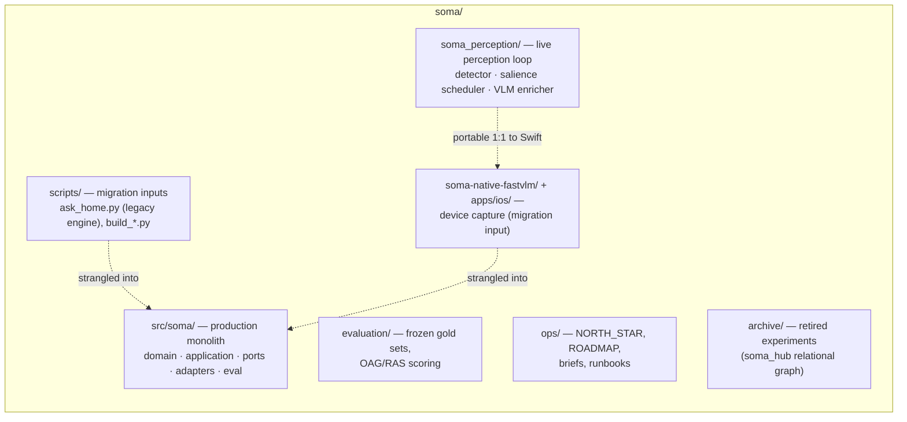

# SOMA Architecture — The Visual Guide

> A diagram-first walkthrough of the whole system: from the napkin sketch to the
> running code. Every box in a diagram is annotated with the module that
> implements it (or the phase that will). The companion deep-dive with full
> references is [`ARCHITECTURE_THESIS.md`](ARCHITECTURE_THESIS.md).

All diagrams are Mermaid and render directly on GitHub.

---

## 1. The founding idea: copy the standard model of perception

The napkin starts with the "Standard Model": the world reaches a brain only
through senses, and for a machine the only senses we can cheaply manufacture
are eyes and ears. SOMA takes that constraint seriously — everything downstream
is a consequence of it.

The twist that makes SOMA different from a recorder: **the machine's brain never
stores what the eyes saw — only the words the eyes produced.** Raw pixels and
audio are discarded the instant they are converted to text.

---

## 2. The napkin, end to end

This is the EXECUTION row of the sketch, redrawn with each black box named:

Every napkin box now exists in the repo under a production name:

| Napkin | Production name | Where it lives today |
|---|---|---|
| Extraction Black Box | Capture / perception pipeline | `soma_perception/`, `src/soma/ports/perceiver.py` |
| Coordinates + timestamps | `Observation` (`t_ms`, `spatial_anchor`) | `src/soma/domain/observation.py` |
| Macro-picture VLM | Scene-gist VLM, salience-gated | `soma_perception/scheduler.py`, `soma_perception/enricher.py` |
| Specialized eyes / helpers | Perceiver channels: OCR, ASR, detector, sound events | `src/soma/ports/{ocr,asr,vlm_runner}.py`, `scripts/build_*.py` |
| Binder | Nightly SLEEP binding → `Binding` | `src/soma/domain/binding.py`, `src/soma/application/binder.py` (Phase 2) |
| Raw material / first thought | Append-only observation log | `src/soma/adapters/sqlite_eventlog.py` |
| Node Creation Black Box | Projections → EvidenceGraph | `src/soma/application/binder.py` (Phase 2) |
| Encryption "only our app deciphers" | AES-GCM text codec | `src/soma/adapters/encrypted_text.py` |
| Discarder of meta | Disposable projections (raw log never dropped) | event-sourcing design, `sqlite_eventlog.py` docstring |
| Information Supplier Black Box | `Recall` + grounding gate | `src/soma/application/recall.py`, `grounding_gate.py` (Phase 3) |
| Just Enough Context → LLM | RecallBackend prompt assembly | `src/soma/ports/recall_backend.py`, `scripts/ask_home.py` (legacy) |

---

## 3. The machine's three tempos: CAPTURE → SLEEP → ASK

The pipeline above runs at three different rhythms (from `ops/NORTH_STAR.md`):

```mermaid
flowchart LR
    subgraph CAPTURE["⚡ CAPTURE — live, cheap, parallel"]
        direction TB
        C1["OCR — visible text"]
        C2["ASR — speech"]
        C3["Sound events — cry / alarm / hum"]
        C4["Sensors — motion / location / pose"]
        C5["Scene gist — small VLM,<br/>ONLY on attention / dwell / change"]
    end
    subgraph SLEEP["🌙 SLEEP — nightly, the big model"]
        direction TB
        S1["Congregate the day's words"]
        S2["Dedupe"]
        S3["BIND by when + where co-occurred:<br/>which hum was the fan,<br/>which blue thing was the bag"]
        S4["Confidence per binding —<br/>weak links REFUSED, not hardened"]
    end
    subgraph ASK["❓ ASK — on demand"]
        direction TB
        A1["Answer from bound words only"]
        A2["Cite what was seen"]
        A3["Refuse what wasn't perceived"]
        A4["Never re-open raw<br/>(there is no raw)"]
    end
    CAPTURE -->|"append-only<br/>observation log"| SLEEP -->|"EvidenceGraph"| ASK
```

The napkin's "always running in the background **but better nightly**" is
exactly this split: binding runs continuously as an accelerator, but the deep
pass happens at night when compute is free and thermal limits don't bite.

---

## 4. The privacy boundary — the one-way membrane

The system's defining invariant is *structural*, not policy: raw media cannot
persist and cannot leave, because the types make it impossible.

Three enforcement layers, from `src/soma/application/egress_guard.py`,
`src/soma/domain/egress.py`, and `src/soma/adapters/encrypted_text.py`:

1. **Type system** — `TextEgress` is the only payload type allowed across the
   boundary, and it must carry provenance (`source_event_ids`).
2. **Runtime guard** — `EgressGuard.text()` raises `PrivacyViolationError` for
   any other object.
3. **Encryption at rest** — the text memory itself is AES-GCM encrypted
   ("people using our app can decipher" on the napkin).

---

## 5. The attention economy: coarse passerby, fine fixation

"Maximum context" and "detail follows attention" are in tension. The
resolution — the moat — is the salience-scored, budget-governed enrichment
scheduler (`soma_perception/scheduler.py`):

This is the napkin's "a specialized eye or helper for various tasks; call as
needed" made precise: helpers are cheap and always on; the *expensive* eye (the
VLM) is only pointed where attention dwells, and how long attention dwells
determines how deep it looks (overview → attributes → minutiae).

---

## 6. Inside the code: a hexagonal monolith

`src/soma/` is a ports-and-adapters modular monolith. The domain knows nothing
about devices, models, or storage; everything concrete plugs in at the edge.

Two structural bets worth seeing:

- **Event sourcing.** The append-only observation log is the single source of
  truth. The EvidenceGraph, vector index, and anything else "marinated" are
  **projections — disposable and replayable**. This is the napkin's discarder
  rule verbatim: *"the marinated content that's not useful is discarded, not
  the raw material."*
- **Strangler fig.** The 2,800-line legacy answer engine
  (`scripts/ask_home.py`) still answers questions, but only through the
  `Recall` → `RecallBackend` → `LegacyAskHome` boundary. It is replaced
  capability by capability without a big-bang rewrite.

---

## 7. Answering a question: the full round trip

The napkin's last arrow — "Just Enough Context → LLM does what LLM does" — is
the design's humility: the LLM is a commodity reasoner at the end of the pipe.
The value is everything before it: what was perceived, how it was bound, and
what evidence is placed in front of the model.

---

## 8. How we know it works: the measurement loop

Every failure is mechanically diagnosed as (A) *context was never captured* or
(B) *the brain failed to use captured context* — so every miss names the next
thing to build (`ops/ROADMAP.md` §3–4).

Nothing is built on intuition: **a helper only exists because a missed question
demanded it.** The current honest baseline (walk clip): RAS 40.0, hallucination
27.3%, with 8 of 9 misses diagnosed as (B) — the wall is the brain, not the
sensors.

---

## 9. Where everything lives

**Reading order for a newcomer:** this file → `ops/NORTH_STAR.md` →
`ops/ROADMAP.md` → `src/soma/domain/` (30 minutes, it's tiny) →
[`ARCHITECTURE_THESIS.md`](ARCHITECTURE_THESIS.md) for the full argument and
literature.
